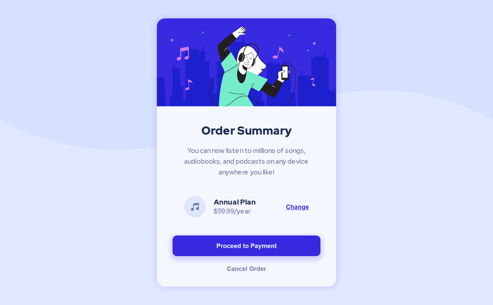

# Frontend Mentor - Order summary card solution

This is a solution to the [Order summary card challenge on Frontend Mentor](https://www.frontendmentor.io/challenges/order-summary-component-QlPmajDUj). Frontend Mentor challenges help you improve your coding skills by building realistic projects.

## Table of contents

- [Overview](#overview)
  - [The challenge](#the-challenge)
  - [Screenshot](#screenshot)
  - [Links](#links)
- [My process](#my-process)
  - [Technology Used](#technology-used)
  - [Folder Structure](#folder-structure)
  - [Compiling SASS](#compiling-sass)
- [Author](#author)

## Overview

### The challenge

Users should be able to:

- See hover states for interactive elements

### Screenshot



### Links

- **Solution:** [frontendmentor.io/solutions/order-summary-component-vnoSFmyFtO](https://www.frontendmentor.io/solutions/order-summary-component-vnoSFmyFtO)
- **Live Site:** [fem-order-summary-component-9as.pages.dev](https://fem-order-summary-component-9as.pages.dev)

## My process

### Technology Used

This project was built using the following frontend technologies and methodologies:

- **Semantic HTML5 markup:** To provide a clear and meaningful structure to the content.
- **CSS custom properties:** To efficiently manage and reuse style values throughout the project.
- **Flexbox:** To create flexible and responsive layouts.
- **SASS:** To write CSS more efficiently with nested rules, variables, and mixins.
- **BEM (Block Element Modifier):** To create modular, reusable, and maintainable CSS code.
- **Mobile-first workflow:** To ensure a better user experience on smaller screens and devices.

### Folder Structure

```markdown
./
├─ assets/
│ ├─ css/
│ ├─ images/
│ └─ scss/
│   ├─ globals/
│   ├─ util/
│   └─ style.scss
├─ screenshots/
├─ README.md
└─ index.html
```

### Compiling SASS

If you're new to SASS or need a quick refresher, this guide will walk you through the process of compiling SASS code into CSS for your vanilla HTML project.

#### Prerequisites

Before you start, make sure you have Node.js and NPM installed on your machine. If you don't have them installed, you can download them from [here](https://nodejs.org/en/).

#### Installation

Once you have Node.js and NPM installed, you can install SASS by running the following command in your terminal:

```bash
npm install -g sass
```

#### Usage

#### Step 1: Create a SASS file

Create a new SASS file in your project's `assets/scss` directory. You can use `style.scss` as your starting point.

#### Step 2: Write your SASS code

Write your SASS code in the SASS file you created in **step 1**. For example:

```scss
$primary-color: #3d3d3d;

body {
  background-color: $primary-color;
}
```

#### Step 3: Compile your SASS code

Compile your SASS code into CSS by running the following command in your terminal:

```bash
sass assets/scss/style.scss:assets/css/style.css
```

This command tells the SASS compiler to compile the `style.scss` file in the `assets/scss` directory and output the resulting CSS into the `assets/css` directory as `style.css`.

#### Step 4: Link your CSS file

Link your compiled CSS file in your HTML file by adding the following code to the `<head>` section:

```html
<link rel="stylesheet" href="assets/css/style.css" />
```

#### Step 5: Re-compile your SASS code

Whenever you make changes to your SASS file, you will need to recompile it by running the sass command again. This will update the compiled CSS file and ensure that your changes are reflected in the browser.

That's it! Now you know how to compile SASS code into CSS for your vanilla HTML project. If you have any questions or issues, feel free to refer to the official [SASS documentation](https://sass-lang.com/documentation)

## Author

This project was created by **Fortune Iyoha**, a passionate web developer. If you want to connect with me or view more of my projects, you can visit my [Frontend Mentor profile](https://www.frontendmentor.io/profile/fortune-i-o) or follow me on [Twitter](https://twitter.com/fortuneiyoha) for updates and web development discussions.
