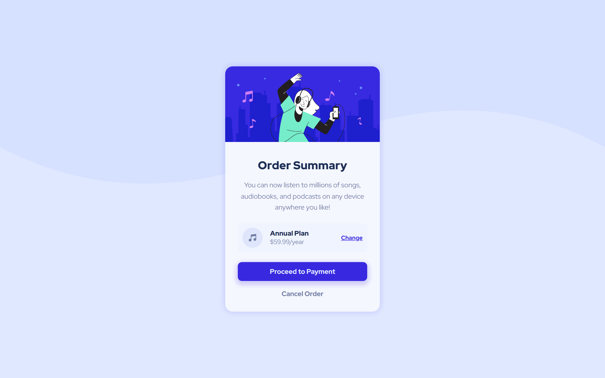

# Frontend Mentor - Order summary card solution

This is a solution to the [Order summary card challenge on Frontend Mentor](https://www.frontendmentor.io/challenges/order-summary-component-QlPmajDUj). Frontend Mentor challenges help you improve your coding skills by building realistic projects.

## Table of contents

- [Overview](#overview)
  - [The challenge](#the-challenge)
  - [Screenshot](#screenshot)
  - [Links](#links)
- [My process](#my-process)
  - [Built with](#built-with)
- [Author](#author)

## Overview

### The challenge

Users should be able to:

- See hover states for interactive elements

### Screenshot

### Links

- Solution URL: [frontendmentor.io/solutions/order-summary-component-vnoSFmyFtO](https://www.frontendmentor.io/solutions/order-summary-component-vnoSFmyFtO)
- Live Site URL: [fem-order-summary-component-9as.pages.dev](fem-order-summary-component-9as.pages.dev)

## My process

### Built with

- Semantic HTML5 markup
- CSS custom properties
- Flexbox
- Mobile-first workflow

## Author

- Website - [fortune-io-socials](https://fortune-io-socials.pages.dev/)
- Frontend Mentor - [@fortune-i-o](https://www.frontendmentor.io/profile/fortune-i-o)
- Twitter - [@fortune_oi](https://www.twitter.com/fortune_oi)
